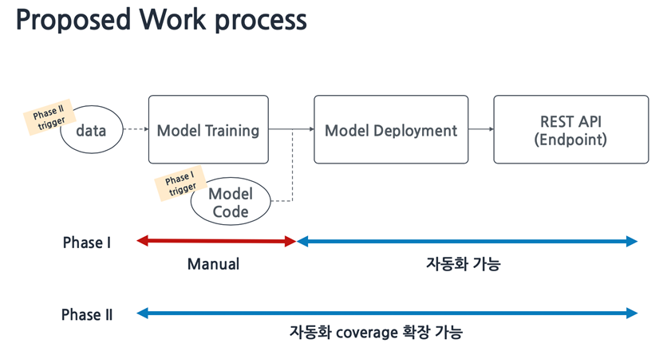
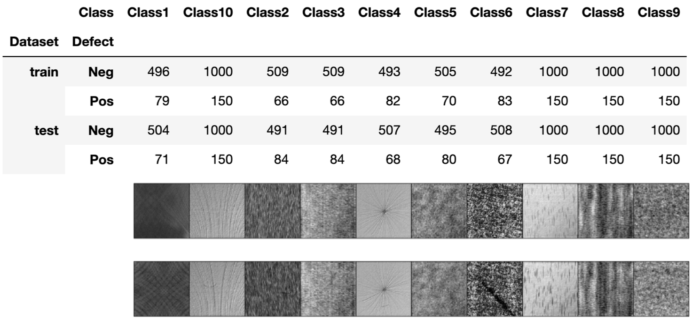
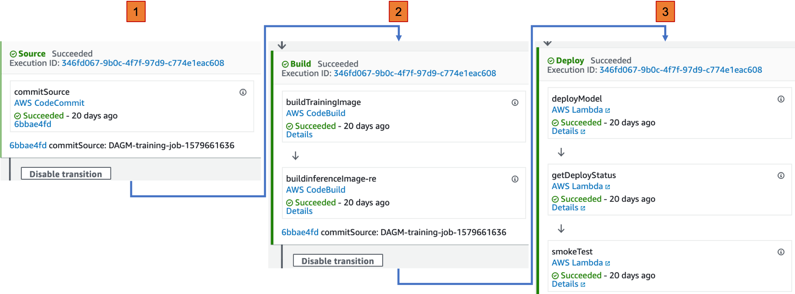
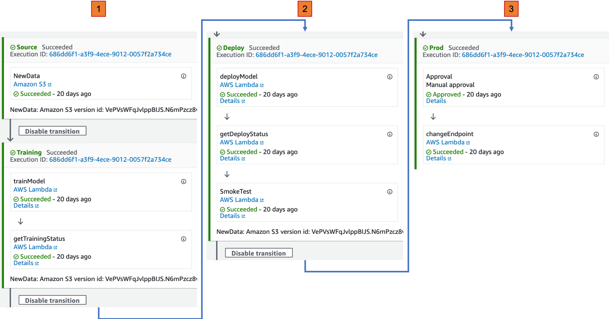

# Amazon Sagemaker MLops via [AWS CodePipeline](https://aws.amazon.com/codepipeline/)

<div align="left">
  
</div>

## Introduction

[Amazon SageMaker](https://aws.amazon.com/sagemaker) is a fully managed service that provides every developer and data scientist with the ability to build, train, and deploy machine learning (ML) models quickly.

SageMaker solves this challenge by providing all of the components used for machine learning in a single toolset so models get to production faster with much less effort and at lower cost as a below.

<div align="center">
  
</div>

## MLOps (Machine Learning Operations) from Wikipedia

MLOps (a compound of “machine learning” and “operations”) is a practice for collaboration and communication between data scientists and operations professionals to help manage production ML (or deep learning) lifecycle.

## Proposed Work process

<div align="center">
  
</div>
The Machine Learning development is included a complex, expensive, and iterative process. Recently, many of customers are considering how to take ML out of R&D and into production at scale, using the same Devops best practices that have proven valuable in traditional software development. 
In this demo, I focus on automated ways replaced of repetitive processes at the inference process after creating models by data scientists. Experienced, manual works are required like artists during training processes because data scientists have amounts of trial and errors to create models during training process.  The data scientists' competency and experiences has a effect on The model performance. After that, the Inference process is an iterative process. Therefore, the more manual intervened works do, the higher errors may be.
 
 ## Environments
  ### dataset : [DAGM 2007 Dataset](https://hci.iwr.uni-heidelberg.de/node/3616)
  <div align="center">
  
  </div>
  ### Deep learning framework : Pytorch
  ### Main language : python 3.6
  ### AWS Services
```
    You should have some basic experience with:
    - [Amazon SageMaker](https://aws.amazon.com/sagemaker/)
      - Amazon SageMaker Experiments
      - Amazon SageMaker Debugger
    - [AWS Lambda](https://aws.amazon.com/lambda/)
    - [AWS CodePipeline](https://aws.amazon.com/codepipeline/)
    - [AWS CodeCommit](https://aws.amazon.com/codecommit/)
    - [AWS CodeBuild](https://aws.amazon.com/codebuild/)
    - [Amazon ECR](https://aws.amazon.com/ecr/)
    - [AWS S3](https://aws.amazon.com/s3/)
    - [Amazon Simple Notification Service](https://aws.amazon.com/sns/)
    - [Amazon API Gateway](https://aws.amazon.com/api-gateway/)
    - [Amazon CloudWatch](https://aws.amazon.com/cloudwatch/)
```
## Scenario
There are two phases in the demo. The MLOps process at the first phase is performed automatically after pushing source codes for models to the AWS CodeCommit (similar to the Github). The process includes from deploying to hosting a model from which users can receive a result of classification via REST API. The detailed process is as a below.
<div align="center">
  
</div>

The second phase is started the MLOps process repetitively whenever the new dataset is prepared. After hosting models, various deviations are detected such as data drift that can degrade model performance over time due to changing of external environments, such as temperature, humid, deformation of data generated devices. Therefore, a Quality team needs to do labeling tasks for new data continuously as a preparation to take remedial actions for models.
When amounts of new labeled dataset are collected in S3, the Quality team pushes a profile of the new dataset typed .csv or .txt to specific bucket in S3, and then the second MLOps process is performed automatically from training job to hosting a new model replaced of an existing model without stopping a real-time predicted services in a canary way of the Amazon API Gateway.

<div align="center">
  
</div>
## Architecture
 1. Phase 1 
<div align="left">
  
</div>
 2. Phase 2 
<div align="left">
  
</div>
