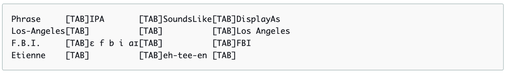
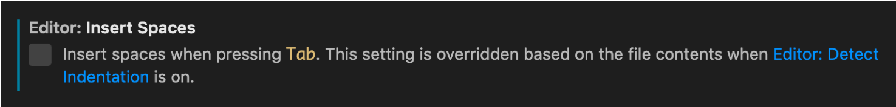
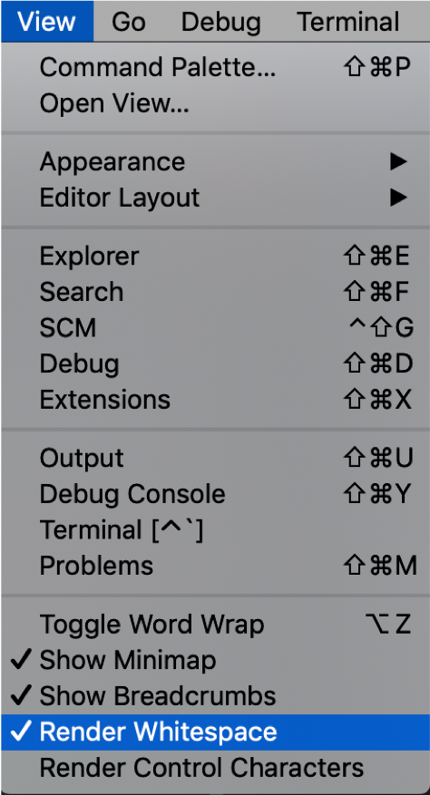

<h1 id="deploy-base-environment">수행 방법</h1>

Amazon Transcribe와 Comprehend를 테스트하기 위해 AWS Services 중 다음 Resources를 사용합니다.

- **S3 (Simple Storage Serivce)** : Object Storage로서 분석할 음성 데이터 파일과 결과 등을 저장하는데 사용합니다.
- **SageMaker Notebook** : Python으로 Amazon Transcribe와 Comprehend 를 실행하기 위한 테스트 환경을 생성합니다.
- **IAM (Identity and Access Management)** : Amazon Transcribe와 Comprehend 를 실행하기 위한 접근 권한을 관리합니다.

먼저 아래 Region 중 하나를 선택하여 클릭합니다. 그러면, 자동으로 CloudFormation을 통해 위 Demo 환경이 만들어 집니다. 

<table>
<thead>
<tr>
<th align="center">Region</th>
<th align="left">Launch Template</th>
</tr>
</thead>
<tbody>
<tr>
<td align="center">N. Virginia (us-east-1)</td>
<td align="left"><a  href="https://console.aws.amazon.com/cloudformation/home?region=us-east-1#/stacks/create/review?stackName=transcribe-comprehend-demo&amp;templateURL=https://napkin-share.s3.ap-northeast-2.amazonaws.com/cloudformation/transcribe-comprehend-demo.yml&amp;" target="_blank"  class="btn btn-default">
  <i class="fas fa-play"></i>
Deploy to AWS N. Virginia
</a>
</td>
</tr>

<tr>
<td align="center">Ohio (us-east-2)</td>
<td align="left"><a  href="https://console.aws.amazon.com/cloudformation/home?region=us-east-2#/stacks/create/review?stackName=transcribe-comprehend-demo&amp;templateURL=https://napkin-share.s3.ap-northeast-2.amazonaws.com/cloudformation/transcribe-comprehend-demo.yml&amp;" target="_blank"  class="btn btn-default">
  <i class="fas fa-play"></i>
Deploy to AWS Ohio
</a>
</td>
</tr>

<tr>
<td align="center">Oregon (us-west-2)</td>
<td align="left"><a  href="https://console.aws.amazon.com/cloudformation/home?region=us-west-2#/stacks/create/review?stackName=transcribe-comprehend-demo&amp;templateURL=https://napkin-share.s3.ap-northeast-2.amazonaws.com/cloudformation/transcribe-comprehend-demo.yml&amp;" target="_blank"  class="btn btn-default">
  <i class="fas fa-play"></i>
Deploy to AWS Oregon
</a>
</td>
</tr>

<tr>
<td align="center">Mumbai (ap-south-1)</td>
<td align="left"><a  href="https://console.aws.amazon.com/cloudformation/home?region=ap-south-1#/stacks/create/review?stackName=transcribe-comprehend-demo&amp;templateURL=https://napkin-share.s3.ap-northeast-2.amazonaws.com/cloudformation/transcribe-comprehend-demo.yml&amp;" target="_blank"  class="btn btn-default">
  <i class="fas fa-play"></i>
Deploy to AWS Mumbai
</a>
</td>
</tr>

<tr>
<td align="center">Seoul (ap-northeast-2)</td>
<td align="left"><a  href="https://console.aws.amazon.com/cloudformation/home?region=ap-northeast-2#/stacks/create/review?stackName=transcribe-comprehend-demo&amp;templateURL=https://napkin-share.s3.ap-northeast-2.amazonaws.com/cloudformation/transcribe-comprehend-demo.yml&amp;" target="_blank"  class="btn btn-default">
  <i class="fas fa-play"></i>
Deploy to AWS Seoul
</a>
</td>
</tr>

<tr>
<td align="center">Singapore (ap-southeast-1)</td>
<td align="left"><a  href="https://console.aws.amazon.com/cloudformation/home?region=ap-southeast-1#/stacks/create/review?stackName=transcribe-comprehend-demo&amp;templateURL=https://napkin-share.s3.ap-northeast-2.amazonaws.com/cloudformation/transcribe-comprehend-demo.yml&amp;" target="_blank"  class="btn btn-default">
  <i class="fas fa-play"></i>
Deploy to AWS Singapore
</a>
</td>
</tr>

<tr>
<td align="center">Sydney (ap-southeast-2)</td>
<td align="left"><a  href="https://console.aws.amazon.com/cloudformation/home?region=ap-southeast-2#/stacks/create/review?stackName=transcribe-comprehend-demo&amp;templateURL=https://napkin-share.s3.ap-northeast-2.amazonaws.com/cloudformation/transcribe-comprehend-demo.yml&amp;" target="_blank"  class="btn btn-default">
  <i class="fas fa-play"></i>
Deploy to AWS Sydney
</a>
</td>
</tr>

<tr>
<td align="center">Tokyo (ap-northeast-1)</td>
<td align="left"><a  href="https://console.aws.amazon.com/cloudformation/home?region=ap-northeast-1#/stacks/create/review?stackName=transcribe-comprehend-demo&amp;templateURL=https://napkin-share.s3.ap-northeast-2.amazonaws.com/cloudformation/transcribe-comprehend-demo.yml&amp;" target="_blank"  class="btn btn-default">
  <i class="fas fa-play"></i>
Deploy to AWS Tokyo
</a>
</td>
</tr>

<tr>
<td align="center">Central (ca-central-1)</td>
<td align="left"><a  href="https://console.aws.amazon.com/cloudformation/home?region=ca-central-1#/stacks/create/review?stackName=transcribe-comprehend-demo&amp;templateURL=https://napkin-share.s3.ap-northeast-2.amazonaws.com/cloudformation/transcribe-comprehend-demo.yml&amp;" target="_blank"  class="btn btn-default">
  <i class="fas fa-play"></i>
Deploy to AWS Central
</a>
</td>
</tr>

<tr>
<td align="center">Frankfurt (eu-central-1)</td>
<td align="left"><a  href="https://console.aws.amazon.com/cloudformation/home?region=eu-central-1#/stacks/create/review?stackName=transcribe-comprehend-demo&amp;templateURL=https://napkin-share.s3.ap-northeast-2.amazonaws.com/cloudformation/transcribe-comprehend-demo.yml&amp;" target="_blank"  class="btn btn-default">
  <i class="fas fa-play"></i>
Deploy to AWS Frankfurt
</a>
</td>
</tr>

<tr>
<td align="center">Ireland (eu-west-1)</td>
<td align="left"><a  href="https://console.aws.amazon.com/cloudformation/home?region=eu-west-1#/stacks/create/review?stackName=transcribe-comprehend-demo&amp;templateURL=https://napkin-share.s3.ap-northeast-2.amazonaws.com/cloudformation/transcribe-comprehend-demo.yml&amp;" target="_blank"  class="btn btn-default">
  <i class="fas fa-play"></i>
Deploy to AWS Ireland
</a>
</td>
</tr>

<tr>
<td align="center">London (eu-west-2)</td>
<td align="left"><a  href="https://console.aws.amazon.com/cloudformation/home?region=eu-west-2#/stacks/create/review?stackName=transcribe-comprehend-demo&amp;templateURL=https://napkin-share.s3.ap-northeast-2.amazonaws.com/cloudformation/transcribe-comprehend-demo.yml&amp;" target="_blank"  class="btn btn-default">
  <i class="fas fa-play"></i>
Deploy to AWS London
</a>
</td>
</tr>

</tbody>
</table>

AWS Console에 로그인을 한 후 CloudFormation에서 요구하는 Parameters 정보를 추가합니다. XXX를 다른 문자로 추가합니다. 

- **S3 Bucket Name** : transcribe-comprehend-demo-test-XXX (Globally unique 해야 함)
- **NotebookName** : SageMaker Notebook 이름 (default : Transcribe-Comprehend-DemoLab)
- **VolumeSize** : SageMaker Notebook에서 사용하는 EBS 용량이며, 분석할 음성데이터 크기에 따라 조정 (default : 10 GB)

생성이 완료된 경우 생성된 S3 Bucket으로 가서 음성 데이터를 upload할 <strong><code> data </code></strong> Folder와 결과 파일을 저장한 <strong><code> output </code></strong> Folder를 생성합니다. 

CloudFormation의 Output 탭에는 생성된 S3 Bucket과 SageMaker notebook 이름, DataAccessRoleArn 정보를 확인할 수 있습니다. <code>DataAccessRoleArn</code>는 Comprehend Topic Modeling에서 활용하므로 복사해서 바로 사용할 수 있도록 합니다.

생성한 region 내 SageMaker로 가면 이미 생성한 Notebook Instance를 확인할 수 있으며, Notebook Instance를 들어가서 Amazon Transcribe와 Comprehend를 수행하시면 됩니다.

<h2>Custom Vocabulary 생성 시 주의 사항</h2>

Custom Vocabulary는 <a href="./1-Transcribe.ipynb">1-Transcribe.ipynb</a> 내 마지막 부분의 cell 에서 words 리스트 형태로 정의하는 방법을 가이드하고 있습니다. 더 높은 정확도를 위해서는 table 형태로 정의도 가능합니다. 하지만 작성 시 아래 사항을 유의하시기 바랍니다.

- IPA 와 SoundLike는 둘 중 하나만 선언이 가능
- 각 column 사이는 공백 (space) 없이 Tab 만 가능
- 일반적인 개발 툴 및 Text Editor 의 경우 Tab 이 space 4번으로 설정되어 있으며, 이를 그대로 사용할 경우 Error 가 발생
  - VScode 의 경우, setting 에서 tab 사용 시 space 추가 설정을 해제
    

  - 아래 설정을 하면 tab과 space 구분이 가능
    

자세한 예시는 <a href="./custom-vocabulary-example">custom-vocabulary-example</a> Folder에서 확인이 가능합니다.

